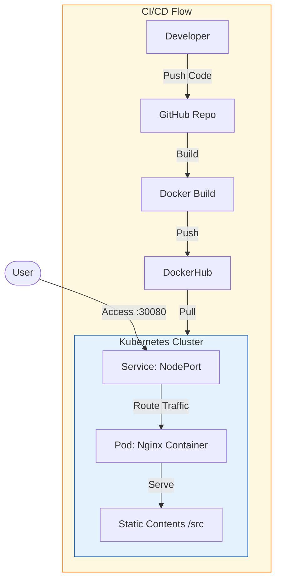

# Static Website Deployment: Docker & Kubernetes

## 🚀 Project Overview

This project demonstrates a complete **DevOps workflow** for deploying a modern static website. It leverages **Docker** for containerization and **Kubernetes** for orchestration, showcasing scalable and reliable deployment practices.

The website itself has been modernized with a **premium Glassmorphism design** and includes an **interactive architecture page**.

### 🏗 Architecture



## 📂 Repository Structure

```
.
├── Dockerfile              # Docker build instructions
├── k8s/
│   └── deployment.yaml     # Kubernetes Deployment & Service manifests (with Probes & Limits)
├── src/                    # Source code for the website
│   ├── index.html          # Home page
│   ├── about.html          # About page
│   ├── membership.html     # Membership page
│   ├── contact.html        # Contact page
│   ├── architecture.html   # NEW: Interactive Architecture Diagram
│   └── styles.css          # Premium CSS styles
└── README.md               # Documentation
```

## 🛠 Tech Stack

-   **Frontend**: HTML5, CSS3 (Glassmorphism, Animations), Mermaid.js
-   **Containerization**: Docker, Nginx (Alpine Linux)
-   **Orchestration**: Kubernetes (Deployments, Services, Health Probes)

## 🏁 Getting Started

### 1. Build the Docker Image

```bash
docker build -t devrahul16/myweb:v1 .
```

### 2. Run Locally (Docker)

```bash
docker run -d -p 8080:80 devrahul16/myweb:v1
```
Visit `http://localhost:8080` to see the site.

### 3. Deploy to Kubernetes

```bash
# Apply the configuration
kubectl apply -f k8s/deployment.yaml

# Check status
kubectl get pods
kubectl get svc
```

Access the application at `http://localhost:30080` (or your minikube/cluster IP).

### 4. Push to DockerHub (Optional)

```bash
docker push devrahul16/myweb:v1
```

## ✨ New Features
-   **Modern UI**: Fully responsive, dark-themed design with smooth animations.
-   **Health Checks**: Liveness and Readiness probes added to Kubernetes config.
-   **Resource Management**: CPU and Memory limits defined for best practices.
-   **Interactive Docs**: Check `architecture.html` for a live flow diagram.

## Author
Rahul Kumar
